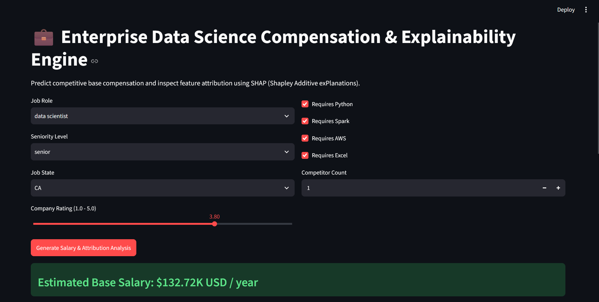
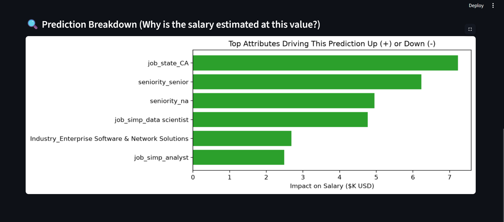

**Repository Description**  
An end-to-end Machine Learning pipeline estimating data science compensation using a tuned Random Forest Regressor and SHAP explainability, deployed interactively via Streamlit and Heroku.

---

# 💼 Enterprise Data Science Salary & Explainability Engine

🔗 **Live Application Demo:** [Insert Your Heroku URL Here]

## 📌 Project Overview & Business Value
The data science job market is highly fragmented, with compensation varying drastically based on specific toolchains, geographic hubs, and company profiles. This project bridges the information gap by providing a robust, data-driven benchmarking tool for Data Analysts, Machine Learning Engineers, and Data Scientists. 

Beyond simply outputting a predicted salary, this application integrates **model explainability** to demystify the black box of machine learning. It provides users with a granular breakdown of exactly which features (e.g., knowing Apache Spark, working in California, or holding a Senior title) are driving their market value up or down.

## 🗄️ Data Engineering & Feature Space
The model is trained on a rigorously cleaned dataset of scraped data science job postings[cite: 1]. Key features ingested by the model include:
* **Role Characteristics:** Job title classification (Data Scientist, MLE, Data Engineer, Analyst, Manager, Director) and Seniority (Junior, Senior, N/A)[cite: 1].
* **Technical Stack:** Binary flags for high-demand skills (Python, Apache Spark, AWS, Advanced Excel)[cite: 1].
* **Company & Market Metrics:** Glassdoor rating, competitor count, employee size, ownership type, industry, sector, and annual revenue[cite: 1].
* **Geographic Indicators:** Job location state to capture regional cost-of-living and tech-hub premiums[cite: 1].

## ⚙️ Machine Learning Architecture
The core inference engine was developed through iterative experimentation and strict cross-validation. 

1. **Preprocessing:** Raw inputs are parsed into a Pandas DataFrame and transformed via one-hot encoding[cite: 1]. To ensure production stability and prevent feature drift, incoming data is dynamically re-indexed against a serialized training schema (`model_columns.pkl`). Missing categories are safely filled with zeros.
2. **Algorithm Selection & Benchmarking:** Three distinct regression architectures were evaluated using 3-fold cross-validation, scored on Mean Absolute Error (MAE)[cite: 1].
3. **Hyperparameter Tuning:** The winning Random Forest model was optimized using `GridSearchCV`[cite: 1]. The search space included the number of trees (`n_estimators`: 50, 100, 200), split criteria, and max features (`sqrt`, `log2`, None)[cite: 1].

### Evaluation Metrics
| Model Architecture | Evaluation Metric | Test Performance |
| :--- | :--- | :--- |
| **Ordinary Least Squares (OLS)** | Adjusted R-squared / MAE | Adj R-squared = 0.638, MAE ≈ 19.53[cite: 1] |
| **Lasso Regression** (alpha = 0.32) | MAE | MAE ≈ 20.36[cite: 1] |
| **Tuned Random Forest Regressor** | **MAE** | **MAE ≈ 13.53 (Selected Model)**[cite: 1] |

## 🔍 Model Explainability (SHAP)
To build trust and provide actionable intelligence, the application utilizes a `shap.TreeExplainer`. This generates a dynamic waterfall attribution chart during inference. Instead of a static estimate, the user sees a real-time visualization of the localized feature importance, quantifying the exact dollar-value impact of their attributes on the final prediction.

## 🛠️ Technology Stack
* **Language:** Python 3.10+
* **Machine Learning:** Scikit-Learn, Pandas, NumPy
* **Explainable AI (XAI):** SHAP, Matplotlib
* **Frontend Web Application:** Streamlit
* **Production Deployment:** Heroku, Gunicorn, Git

